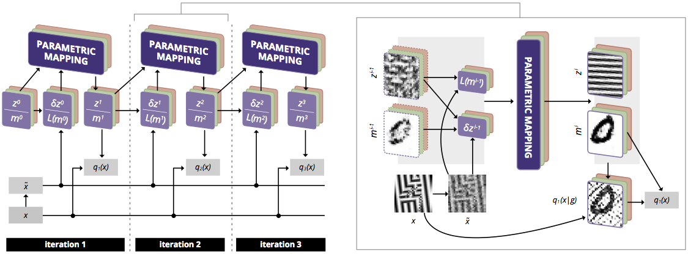

# Tagger: Deep Unsupervised Perceptual Grouping



We present a framework called TAG (iTerative Amortized Grouping) for efficient perceptual inference
that explicitly reasons about the segmentation of its inputs and features. Tagger is the [Ladder](https://github.com/CuriousAI/ladder)
network wrapped in the TAG framework. This is the source code to replicate all experiments in the Tagger [paper](https://arxiv.org/abs/1606.06724)!
Tagger is developed by [The Curious AI Company](http://http://www.thecuriousaicompany.com) with 
collaborations from Klaus Greff and Jürgen Schmidhuber, Swiss AI Lab [IDSIA](http://www.idsia.ch).
The full length paper can be found at [arXiv:1606.06724](https://arxiv.org/abs/1606.06724). Please use the following information for citation,
```
@misc{1606.06724,
   Author = {K. Greff and A. Rasmus and M. Berglund and T. Hao and J. Schmidhuber and H. Valpola},
   Title = {Tagger: Deep Unsupervised Perceptual Grouping},
   Year = {2016},
   Eprint = {arXiv:1606.06724},
}
```


## Installation

### Requirements
 - Linux or MacOS (fully tested on Ubuntu 14.04). No Windows support at the moment.
 - [Anaconda](https://www.continuum.io/downloads)

### Setup (you only need to do it once):
```
bash ./install.sh
```
This downloads the dataset and pre-trained network parameters, installs submodules, and creates the Anaconda environment.
After the installations, please run
```
source activate tagger
```

## Experiments

The experiments train a newborn network to do perceptual grouping. The MNIST experiments also learn to perform classification.

### Shapes50k20x20
To run the shapes50k20x20 experiment, please run
```
python runner-shapes50k20x20.py
```

### Freq20-2MNIST and Freq20-1MNIST

Freq20-2MNIST experiment has two stages. Stage 1 is about unsupervised
learning of perceptual grouping, where we turn off the supervised learning cost.
In stage 2, the trained model in stage 1 is loaded with the addition of new
randomly initialized layers on top. Here the supervised signals are turned on and
we continue to train the network for classification tasks.

For stage 1 of the experiment, please run
```
python runner-freq20-2mnist.py --pretrain
```
The hyperparameters and trained parameters are stored in the `results` folder. It has all
the necessary data to re-load the model. For stage 2, please run
```
python runner-freq20-2mnist.py --continue LOAD_FROM
```
where `LOAD_FROM` is the path of the stage 1 training results.


## Visualizing pre-trained models

The training done in the experiments above could run for several hours on a modern GPU.
Therefore, pre-trained networks are provided in the `pretrained_models` folder.

The following visualizations are created using the pre-trained models and `publication_visualization.ipynb`.
For figure explanations, please check out the paper.

Network Visualization on Shapes50k20x20 dataset                                                                                                      |  Network Visualization on Freq20-2MNIST dataset
----------------------------------------------------------------------------------------------------------------------------------------------------:|:-------------------------------------------------------------------------------------------------------------------------------------------------
 </img> | </img>

## Datasets

The dataset generation scripts can be found in the `data` folder. To the best of our knowledge, the shapes dataset was
first used in Reichert, D. P., Series, P, and Storkey, A. J. [_A hierarchical generative model of recurrent object-based attention in the visual cortex_](http://homepages.inf.ed.ac.uk/pseries/pdfs/DBM_attention_ICANN.pdf). In ICANN, pp. 18–25. Springer, 2011.
The Freq20-2MNIST and Freq20-1MNIST datasets are created by us. If you use it, please cite our paper, much appreciated!


### Shapes50k20x20 generation

Please run `data/shapes.py`. This should generate the shapes dataset. The 
pre-generated dataset (downloaded by `install.sh`) can also be downloaded from [here](http://cdn.cai.fi/datasets/shapes50k_20x20_compressed_v2.h5)

### Freq20-2MNIST and Freq20-1MNIST generation

Please run the notebook `data/FreqMNIST28.ipynb`. The notebook contains all the
necessary steps to generate the dataset. The pre-generated dataset (downloaded by `install.sh`) can also be 
downloaded from [here](http://cdn.cai.fi/datasets/freq20-1MNIST_compressed.h5) and [here](http://cdn.cai.fi/datasets/freq20-2MNIST_compressed.h5)


## Discussion & Contribution

As a demonstrative source code release for our research, this repository will not be
further developed, except for minor compatibility and bug fixes. However, 
discussions are always more than welcome! Please open an issue on the github 
page when you have anything in mind. 

1. If you encounter issues understanding the structures of the algorithm,
please take a look at the paper. The code is designed to follow the algorithm
devised in the paper.
2. If you encounter issues understanding the monitoring of the experiments,
please take a look at Blocks & Fuel. If it's not yet clear, please create an 
issue.
3. Even though we have provided the `environment.yml` for the execution
environment replication, it will not be bullet proof. Please try your best to
create an isolated environment for the experiments, hence minimizing issues
from external dependencies.
4. Tagger uses [Ladder](https://github.com/CuriousAI/ladder) as a parametric
mapping. If your questions or problems are related to Ladder Networks, please
go to that repo.


## License (3-clause BSD)

Copyright (c) 2016, The Curious AI Company
All rights reserved.

Redistribution and use in source and binary forms, with or without modification,
are permitted provided that the following conditions are met:

1. Redistributions of source code must retain the above copyright notice, this
list of conditions and the following disclaimer.

2. Redistributions in binary form must reproduce the above copyright notice,
this list of conditions and the following disclaimer in the documentation and/or
other materials provided with the distribution.

3. Neither the name of the copyright holder nor the names of its contributors
may be used to endorse or promote products derived from this software without
specific prior written permission.

THIS SOFTWARE IS PROVIDED BY THE COPYRIGHT HOLDERS AND CONTRIBUTORS "AS IS" AND
ANY EXPRESS OR IMPLIED WARRANTIES, INCLUDING, BUT NOT LIMITED TO, THE IMPLIED
WARRANTIES OF MERCHANTABILITY AND FITNESS FOR A PARTICULAR PURPOSE ARE
DISCLAIMED. IN NO EVENT SHALL THE COPYRIGHT HOLDER OR CONTRIBUTORS BE LIABLE FOR
ANY DIRECT, INDIRECT, INCIDENTAL, SPECIAL, EXEMPLARY, OR CONSEQUENTIAL DAMAGES
(INCLUDING, BUT NOT LIMITED TO, PROCUREMENT OF SUBSTITUTE GOODS OR SERVICES;
LOSS OF USE, DATA, OR PROFITS; OR BUSINESS INTERRUPTION) HOWEVER CAUSED AND ON
ANY THEORY OF LIABILITY, WHETHER IN CONTRACT, STRICT LIABILITY, OR TORT
(INCLUDING NEGLIGENCE OR OTHERWISE) ARISING IN ANY WAY OUT OF THE USE OF THIS
SOFTWARE, EVEN IF ADVISED OF THE POSSIBILITY OF SUCH DAMAGE.
